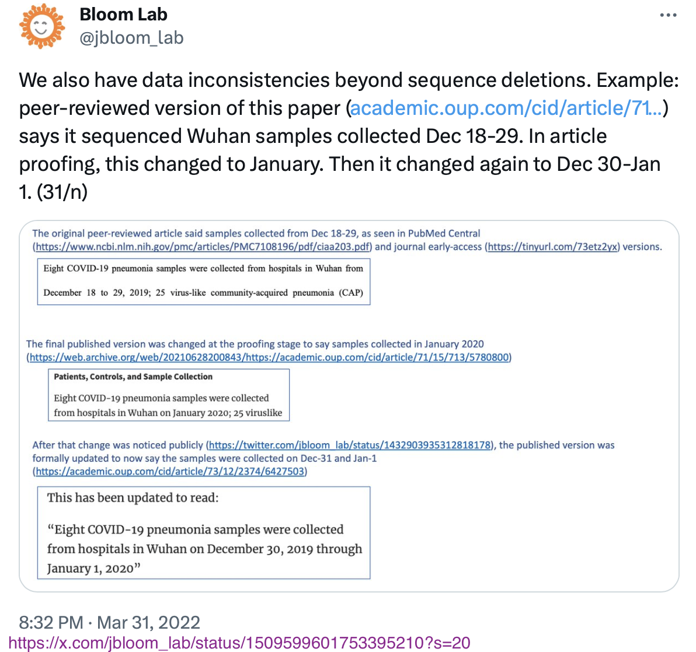
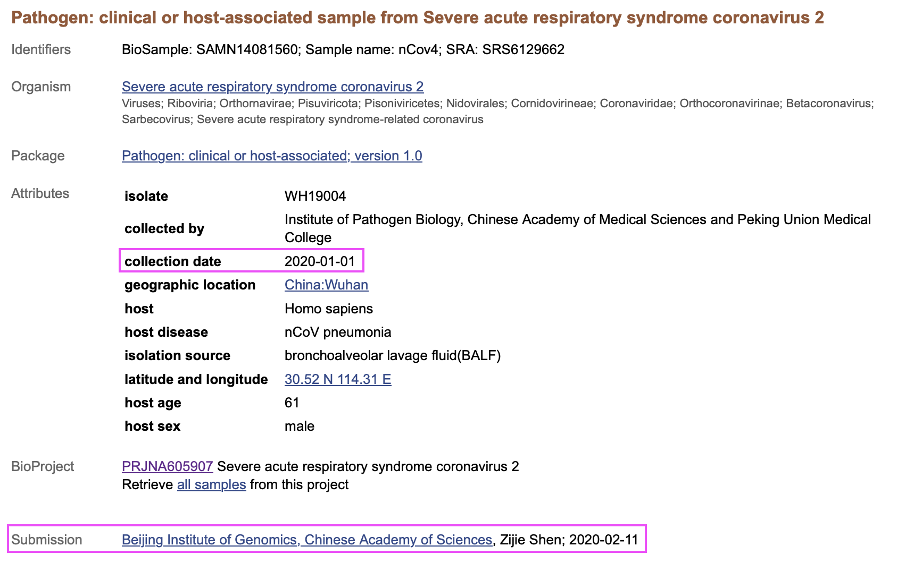
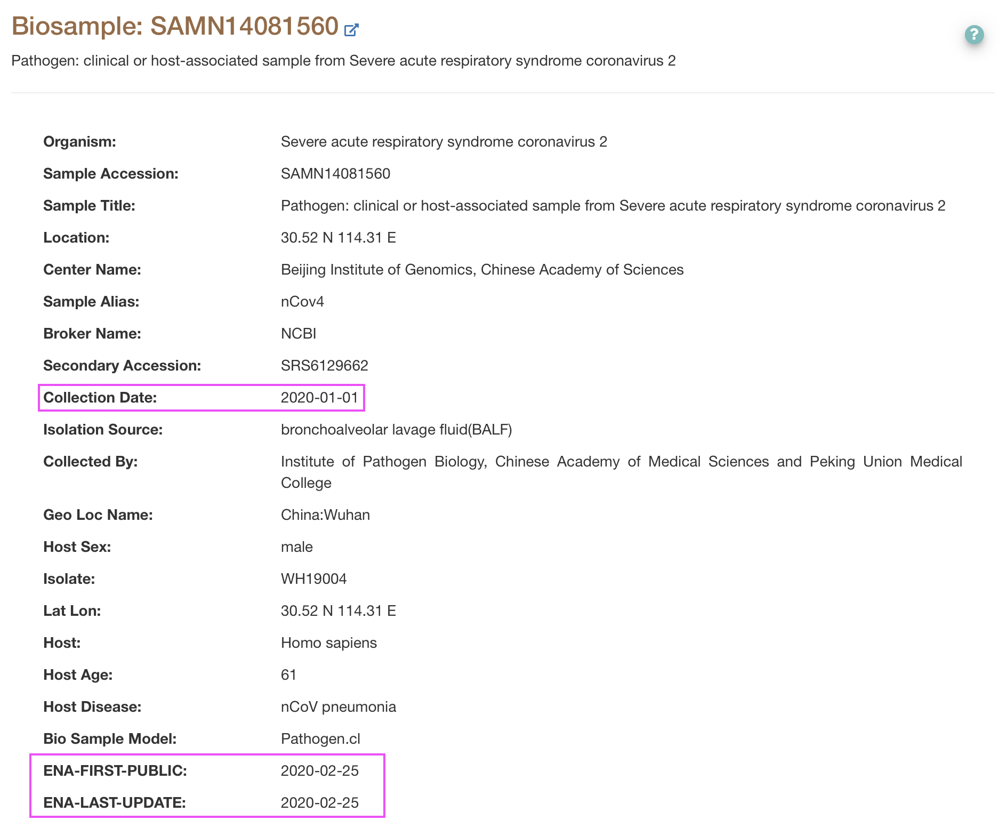
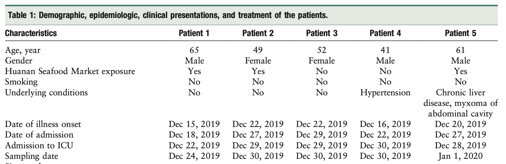

# Shen-etal_2020

TL;DR: The samples sequenced by [Shen et al. (2020)](https://academic.oup.com/cid/article/71/15/713/5780800) were collected between 30 Dec 2019 and 01 Jan 2020 as indicated in the corrected version of their article, and not between 18 Dec and 29 Dec 2019 as originally written.  
-  The sequences were submitted with the correct collection dates.  
-  The 18-29 Dec date range was the range of hospital admission dates from a related paper with authors in common, that included three of the same patients (hospitalized 27-29 Dec).  
There is no evidence of wrongdoing.

## Context  

### Jesse Bloom noticed changes in wording in Shen et al.'s paper

In September 2021, Jesse Bloom [tweeted](https://x.com/jbloom_lab/status/1432903937212891136?s=20) that the collection dates of samples listed in a paper by [Shen et al. (2020)](https://academic.oup.com/cid/article/71/15/713/5780800) had changed between the version accepted by the journal (*Clinical Infectious Diseases*) and the published version.  
The original version read:   
> *Eight COVID-19 pneumonia samples were collected from hospitals in Wuhan from December 18 to 29, 2019*   

and the published version read:  
> *Eight COVID-19 pneumonia samples were collected from hospitals in Wuhan on January 2020*.  

(Archive links are available on Jesse Bloom's [Github repository](https://github.com/jbloom/SARS-CoV-2_Shen_et_al)).

### Shen et al. corrected their article

In November 2021, a [correction](https://academic.oup.com/cid/article/73/12/2374/6427503
) was published, and the new text read:
> *Eight COVID-19 pneumonia samples were collected from hospitals in Wuhan on December 30, 2019 through January 1, 2020*  

(NB: Shen et al.'s Table S1 file was [updated](img/TableS1_v2_metadata.png) in September 2021. The [original](img/TableS1_v1.png) version of Table S1 had issues: the patients' outcomes were interverted for all but one patients).  

The correction was noted by Jesse Bloom in a [Twitter thread](https://x.com/jbloom_lab/status/1509599601753395210?s=20) posted at the end of March 2022, questioning the validity of the corrected dates.  

  
*Screenshot of Jesse Bloom's [tweet](https://x.com/jbloom_lab/status/1509599601753395210?s=20) on the correction.*  

### A New York Times article mentioned the issue

In April 2023, a [New York Times article](https://www.nytimes.com/2023/04/23/world/europe/chinese-censorship-covid.html) mentioned the event, presenting the original dates as the correct ones (emphasis added):  
> *Then on March 9, scientists from top Chinese laboratories published a paper about how the coronavirus might be mutating. The research appeared in Clinical Infectious Diseases, a prestigious journal published by Oxford University Press.*   
>   
> *The topic was seemingly apolitical, but **it relied on samples collected from patients in Wuhan starting in mid-December 2019**. That added to evidence that the virus was spreading widely before the Chinese government took action.*

Here I show elements indicating that the final, the corrected collections dates (30 Dec - 01 Jan) are very likely the correct ones, contrary to what was suggested.

## 1) Collection dates on SRA match the corrected dates

### SRA metadata match Shen et al.'s latest dates

Sequence data were submitted by Shen et al. to the Sequence Read Archive (SRA) on 11 Feb 2020, that is, a week before their article was received by *Clinical Infectious Diseases* (18 Feb 2020). The metadata indicate collection dates ranging from 30 Dec 2019 to 01 Jan 2020, matching Shen et al.'s dates in the latest version of their article. The SRA data were made public on 22 Feb 2020. (NB: a timeline recapitulating all these events is available [here](data/timeline.csv)).

  
*Screenshot of [SRA page](https://www.ncbi.nlm.nih.gov/biosample/14081560), showing at the bottom the 2020-02-11 submission date. The dates are written in the ISO format (YYYY-MM-DD).*

<!-- This should be sufficient evidence confirming that the 30 Dec - 01 Jan collection dates are indeed correct, since this is the information that was provided in February 2020. However, on the topic of Covid origin, it [has been argued](https://x.com/Ayjchan/status/1320348838205526016?s=20) that data on SRA could have been tampered with. Can we confirm these dates? Yes. -->
This should be sufficient evidence confirming that the 30 Dec - 01 Jan collection dates are indeed correct, since this is the information that was provided in February 2020. However, it seems that [metadata can be updated](https://www.ncbi.nlm.nih.gov/sra/docs/submitupdate/#how-do-i-update-other-attributes) on SRA, and the submission date does not change. Jesse Bloom did an [experiment](experiment/) with his own data to confirm that metadata can change on SRA, without any change in the displayed date. So let's cross-check with another database.  

### ENA metadata match SRA

First, data on SRA are synchronised on other databases, including the European Nucleotide Archive (ENA). Conveniently, this other database displays two dates for each record: the date of first publication (`ENA_FIRST_PUBLIC`), and the date of last update (`ENA-LAST-UPDATE`).

In Jesse Bloom's [experiment](experiment/), after synchronization with SRA, his record on ENA shows an updated Collection date, but also an updated `ENA-LAST-UPDATE`. We can therefore trust information shown on ENA: records are how they were on the day of `ENA-LAST-UPDATE`.

The last update date for the Shen et al. records on ENA is the same as the date of first publication, 25 Feb 2020 (which is [3 days](data/timeline.csv) after the data were made public on SRA, and corresponds to the time for the synchronization to take place). This confirms that metadata were not altered since 25 Feb 2020, and we can quite confidently say 22 Feb 2020.

  
*Screenshot of [ENA page](https://www.ebi.ac.uk/ena/browser/view/SAMN14081560), showing at the botton the 2020-02-25 last update date.*

Even though both dates are [before](data/timeline.csv) the first version of article was published anyway, it can still be argued that the collection dates could have been modified between 11 Feb 2020 (date at which the data were submitted) and 22 Feb 2020 (date at which the data were published on SRA) or 25 Feb 2020 (date at which the data were synchronised on ENA). So I asked SRA.

### SRA confirmed that the collection date metadata were not altered

I contacted SRA and asked. They indicated that the collection date metadata of PRJNA605907 (SAMN14081557 to SAMN14081564) had not ever been altered.

This means that on 2020-02-11, the collection dates associated with the Shen et al. sequences were 30 Dec 2019 and 01 Jan 2020, as indicated in the corrected version of their article.

Still, on other subtopics, I have been told that even NCBI or ENA could be complicit and also alter data. We will therefore find a different way to checking Shen et al.'s collection dates. We will do so by matching the samples to actual patients, for whom onset dates are known -- as [suggested](https://x.com/jbloom_lab/status/1432914677692973058?s=20) by Jesse Bloom back in September 2021.

## 2) Onset dates estimated from Shen et al.'s metadata match known onset dates

### Estimating onset dates from Shen et al.'s data  

 The SRA metadata provide the collection dates of each of Shen et al.'s samples. Shen et al.'s [Table S1](https://oup.silverchair-cdn.com/oup/backfile/Content_public/Journal/cid/71/15/10.1093_cid_ciaa203/6/ciaa203_suppl_supplementary_tables_s1-s6.xlsx?Expires=1702851296&Signature=QOB79x~8oxkYCxDC~kmzC3HmLHlWzoK1c-I9FRaO6nYollFklsh0rh9dQRy2wtEkFeJTzt3g~9UIdLZOvAVPL0-6AJsTQsxM4HWHKy8JnBon3DITcdvVlHLjkl-EHT~4Re5ldyRuL~H4-SstCzD1E1IZzg69~V7Di4lLFuxjPmNXHumYktmPfAXaocW7auh82j525fZmRlcZttQuA7CA4C2SOh-aSnX8jPtnviju-AyZoVTbKbHdzhU9JveMNwO8ibX~Bh7qO6i3I84~3EHX9edBVaf3WZ9MXa8OHOD5GWyu9vIsXiijKoITz0a~kTxBDSgmOaHyvcSk1Ew6isMKUw__&Key-Pair-Id=APKAIE5G5CRDK6RD3PGA) additionally contains a "Days after onset" column. Importantly, the values presented in this column were the same in the original version of Table S1, before correction (I did not find it in Jesse Bloom's repo, but I found a [screenshot](img/TableS1_v1.png) in slides prepared by Francisco de Asis). We can substract these values from the collection dates to obtain estimated onset dates.  

### Identifying Shen et al.'s patients  

 In parallel, using the age and sex information shared by Shen et al., as well as the genomic sequences, we can match the patients to patients described in other publications. This step was greatly facilitated by a deduplication table published by [Babarlelephant et al. (2022)](https://zenodo.org/records/6672912). All but one patients could be identified with near certainty (some uncertainty remains for nCov8 / 41M). The results are available in [this table](data/sra-S1.csv), and shown in a figure below.

### Onset dates match

 We can then compare the estimated onset dates (open circles) to the onset dates known from other publications (full circles). They match exactly for five patients, and roughly for the three others (1, 2 and 3-day differences, with the largest difference being for the uncertain patient).

   
 *Onset dates for the different patients in Shen et al. (2020), from other sources (full circles) and computed from information provided by Shen et al. (2020) (open circles). [Source data](data/sra-S1.csv); [script for plotting](scripts/plotDates.R).*

 Finally, we can also note that the sample collection dates listed by Shen et al. match sample collection dates for the same patients in other publications like [Zhou](Zhou-etal_TableS1.png) et al. (2020). Beyond the patients, some of the *samples* also appear in [Lu](https://www.sciencedirect.com/science/article/pii/S0140673620302518?via%3Dihub) et al. (2020) (WH19001, WH19002, WH19004), with 30 Dec-01 Jan collection dates.

 Still, this does not seem to be enough, and the originally announced 18-29 Dec date range brings confusion. Where does it come from?

## The 18-29 December date range was hospitalization dates from a related publication

 The original sentence in Shen et al. (2020) read   
 > *Eight COVID-19 pneumonia samples were collected from hospitals in Wuhan from December 18 to 29, 2019*  

 This sentence matches a sentence in another article, [Ren et al. (2020)](https://journals.lww.com/cmj/fulltext/2020/05050/identification_of_a_novel_coronavirus_causing.3.aspx), with senior authors in common with Shen et al. (2020). Ren et al. was submitted on 25 January 2020, originally [published](img/Ren-etal_pubdate.png) on 11 February 2020. Ren et al. presents the group's first SARS-CoV-2 sequences. Their description of the samples is the following:    
 > *Bronchoalveolar lavage fluid (BAL) samples were collected from five patients hospitalized with pneumonia in Wuhan Jinyintan Hospital, Wuhan, Hubei province, China from December 18 to 29, 2019.*

Three of the five patients from Ren et al. are later included in Shen et al.: patients 2, 3 and 5. Their onset, hospitalization, and sampling dates perfectly match between the two publications. (There is also a 41M patient in Shen et al., but dates do not match. We however know that there were at least two 41M early patients; see [Babarlelephant et al. (2022)](http://zenodo.org/records/6672912) for a discussion).  

  
*Screenshot of part of Table 1 from Ren et al. (2020). Patient 1 was a vendor at Huanan seafood market; he is not included in Shen et al. (2020). Patients 2, 3, 5 are in Shen et al. (2020). Although age and sex match for patient 4, dates do not; he is likely to be another 41M, of [dentist fame](https://www.science.org/doi/abs/10.1126/science.abm4454).*

Hospitalization dates in Table 1 from Ren et al. (2020) range from 18 to 29 Dec, as announced. The earliest date is for Patient 1. Sampling dates of all patients range from 24 Dec to 01 Jan, starting only on 30 Dec if we remove Patient 1. Importantly, the sampling dates of patients 2, 3, 5 are the same as reported in the latest version of Shen et al. These collection dates were also reported on GISAID and on [CNCB](https://ngdc.cncb.ac.cn/biosample/browse/SAMC133242).

The Ren et al. publication independently validates the sampling dates of Shen et al., and provides an explanation for the 18-29 Dec date range.   

## Conclusion

 The samples studied by Shen et al. (2020) were collected between 30 Dec 2019 and 01 Jan 2020. The initial 18-29 Dec date range corresponded to hospitalization dates in a related publication.  There is no evidence that samples were collected before it was even realized that there were cases of a new pneumonia throughout Wuhan.

## Credits

Zach Hensel found the Ren et al. article.  
Jesse Bloom's [experiment](experiment/) with his own data helped establish the reliability of information displayed on ENA.
