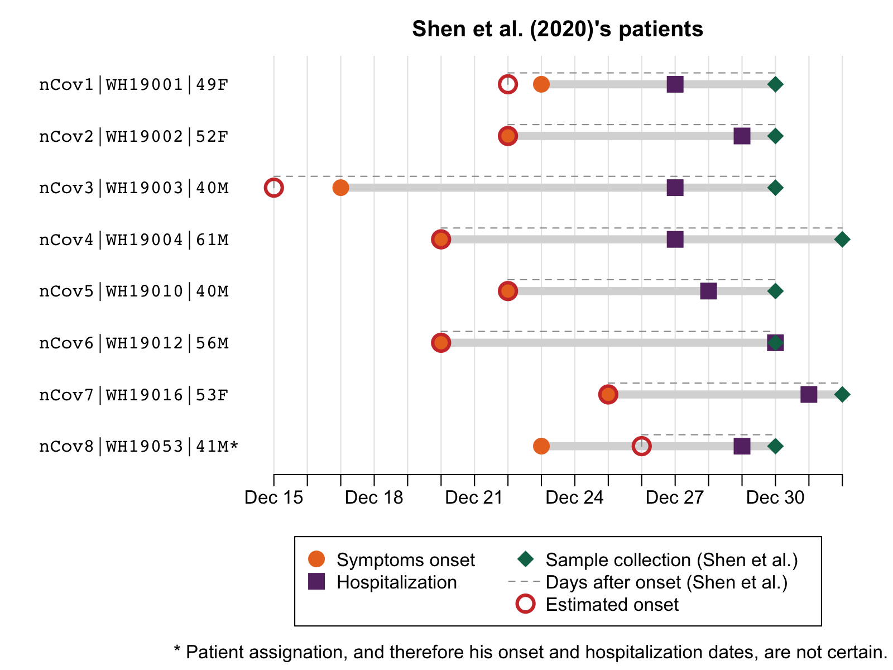

# Shen-etal_2020

TL;DR: The samples sequenced by Shen et al. were collected between 30 Dec 2019 and 01 Jan 2020, and not between 18 Dec and 29 Dec as originally written. 

## Context  

In September 2021, Jesse Bloom [tweeted](https://x.com/jbloom_lab/status/1432903937212891136?s=20) that the collection dates of samples listed in a paper by [Shen et al. (2020)](https://academic.oup.com/cid/article/71/15/713/5780800) had changed between the version accepted by the journal (*Clinical Infectious Diseases*) and the published version.  
The original version read:   
> *Eight COVID-19 pneumonia samples were collected from hospitals in Wuhan from December 18 to 29, 2019*   

and the published version read:  
> *Eight COVID-19 pneumonia samples were collected from hospitals in Wuhan on January 2020*.  

(Archive links are available on Jesse Bloom's [Github repository](https://github.com/jbloom/SARS-CoV-2_Shen_et_al)).

In November 2021, a [correction](https://academic.oup.com/cid/article/73/12/2374/6427503
) was published, and the new text read: 
> *Eight COVID-19 pneumonia samples were collected from hospitals in Wuhan on December 30, 2019 through January 1, 2020*  

(NB: Shen et al.'s Table S1 file was [updated](img/TableS1_v2_metadata.png) in September 2021. It had issues: the patients' outcomes were interverted for all but one patients).  

The correction was noted by Jesse Bloom in a [Twitter thread](https://x.com/jbloom_lab/status/1509599601753395210?s=20), questioning the validity of the corrected dates.  

In April 2023, a [New York Times article](https://www.nytimes.com/2023/04/23/world/europe/chinese-censorship-covid.html) mentioned the event, presenting the original dates as the correct ones:  
> *Then on March 9, scientists from top Chinese laboratories published a paper about how the coronavirus might be mutating. The research appeared in Clinical Infectious Diseases, a prestigious journal published by Oxford University Press.*  
> *The topic was seemingly apolitical, but it relied on samples collected from patients in Wuhan starting in mid-December 2019. That added to evidence that the virus was spreading widely before the Chinese government took action.*
 
Here I show elements indicating that the final, corrected collections dates are very likely the correct ones, contrary to what was suggested. 

## 1) Collection dates on SRA match the corrected dates

Sequence data were submitted by Shen et al. to the Sequence Read Archive (SRA) on 11 Feb 2020, that is, a week before their article was received by *Clinical Infectious Diseases* (18 Feb 2020). The metadata indicate collection dates ranging from 30 Dec 2019 to 01 Jan 2020, matching Shen et al.'s dates in the latest version of their article. The SRA data were made public on 22 Feb 2020. (NB: a timeline recapitulating all these events is available [here](data/timeline.csv).

  
Screenshot of [SRA page](https://www.ncbi.nlm.nih.gov/biosample/14081560), showing at the bottom the 2020-02-11 submission date. 

This should be sufficient evidence confirming that the 30 Dec-01 Jan collection dates are indeed correct. However, on the topic of Covid origin, it [has been argued](https://x.com/Ayjchan/status/1320348838205526016?s=20) that data on SRA could have been tampered with. Can we confirm these dates? Yes. 

First, data on SRA are synchronised on other databases, including the European Nucleotide Archive (ENA). Conveniently, this database displays two dates for each record: the date of first publication, and the date of last update (`ENA-LAST-UPDATE`). The last update date for the Shen et al. records on ENA is the same as the date of first publication, 25 Feb 2020, confirming that information was not altered. 

  
Screenshot of [ENA page](https://www.ebi.ac.uk/ena/browser/view/SAMN14081560), showing at the botton the 2020-02-25 last update date. 

Still, on other subtopics, I have been told that even ENA could be complicit and alter data. We will therefore find a different way to checking Shen et al.'s collection dates. We will do so by matching the samples to actual patients, for whom onset dates are known (as [suggested](https://x.com/jbloom_lab/status/1432914677692973058?s=20) by Jesse Bloom in September 2021). 
 
 ## 2) Onset dates estimated from Shen et al.'s metadata match known onset dates
 
 From SRA metadata, we have the collection dates of each of Shen et al.'s samples. Shen et al.'s [Table S1](https://oup.silverchair-cdn.com/oup/backfile/Content_public/Journal/cid/71/15/10.1093_cid_ciaa203/6/ciaa203_suppl_supplementary_tables_s1-s6.xlsx?Expires=1702851296&Signature=QOB79x~8oxkYCxDC~kmzC3HmLHlWzoK1c-I9FRaO6nYollFklsh0rh9dQRy2wtEkFeJTzt3g~9UIdLZOvAVPL0-6AJsTQsxM4HWHKy8JnBon3DITcdvVlHLjkl-EHT~4Re5ldyRuL~H4-SstCzD1E1IZzg69~V7Di4lLFuxjPmNXHumYktmPfAXaocW7auh82j525fZmRlcZttQuA7CA4C2SOh-aSnX8jPtnviju-AyZoVTbKbHdzhU9JveMNwO8ibX~Bh7qO6i3I84~3EHX9edBVaf3WZ9MXa8OHOD5GWyu9vIsXiijKoITz0a~kTxBDSgmOaHyvcSk1Ew6isMKUw__&Key-Pair-Id=APKAIE5G5CRDK6RD3PGA) additionally contains a column "Days after onset". Importantly, the values presented in this column were the same in the original version of Table S1, before correction (I did not find it in Jesse Bloom's repo, but I found a [screenshot](img/TableS1_v1.png) in slides prepared by Francisco de Asis). We can substract these values from the collection dates to obtain estimated onset dates.  
 
 In parallel, using the age and sex information shared by Shen et al., as well as the genomic sequences, we can match the patients to patients described in other publications. This step was greatly facilitated by a deduplication table published by [Babarlelephant et al. (2022)](https://zenodo.org/records/6672912). All but one patients could be identified with near certainty (some uncertainty remains for nCov8 / 41M). The results are available in [this table](data/sra-S1.csv), and shown in a figure below. 
 
 We can then compare the estimated onset dates (open circles) to the onset dates known from other publications (full circles). They match exactly for five patients, and roughly for the three others (1, 2 and 3-day differences, with the largest difference being for the uncertain patient). 
 
 
 
 Finally, we can also note that the sample collection dates listed by Shen et al. match sample collection dates for the same patients in other publications. 
 
 ## Conclusion
 
 The samples studied by Shen et al. (2020) were collected between 30 Dec 2019 and 01 Jan 2020. There is no evidence that the initial 18 Dec-29 Dec date range was correct. This was likely just a confusion with onset dates (though the range we find differs a tiny bit). But there is no evidence that samples were collected before it was even realized that there were cases of a new pneumonia throughout Wuhan. 

  
