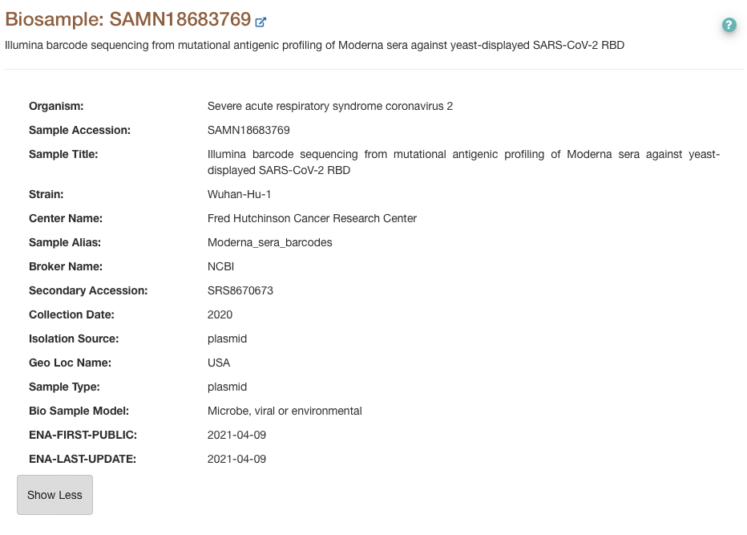

In order to test whether changes in metadata can be spotted for data submitted to SRA, Jesse Bloom did an experiment: he updated the collection date of one of his lab's samples. 

The original sample had been submitted on 09 April 2021, and the Collection date read "2020". Jesse Bloom updated the metadata on 13 November 2023, into "2020-05". 

On [SRA](https://www.ncbi.nlm.nih.gov/biosample/?term=SAMN18683769), the change is not visible. The only date shown is the original submission date, and there does not seem to be any sign that the metadata were updated. This means that we cannot use SRA on its own to determine whether data shown today are the same as when they were submitted.  

Data on SRA are synchronised with other databases, including ENA. Information is shown differently on ENA. In particular, ENA has a `ENA-LAST-UPDATE` field containing the date at which records were changed. After synchronization with SRA, the ENA page for Jesse Bloom's record indicates that some update happened. We can therefore trust information shown on ENA.  

| Before synchronization | After synchronization |  
|---|---|
| |  | 
|[link](https://web.archive.org/web/20231114214857/https://www.ebi.ac.uk/ena/browser/view/SAMN18683769) | [link](https://www.ebi.ac.uk/ena/browser/view/SAMN18683769) |

Data on SRA are also synchronized with DDBJ. As of 2023-11-22 however, Jesse Bloom's metadata change still does not show up on DDBJ ([link](https://ddbj.nig.ac.jp/resource/biosample/SAMN18683769); [2023-11-22 archive](https://archive.is/w8bie)).

